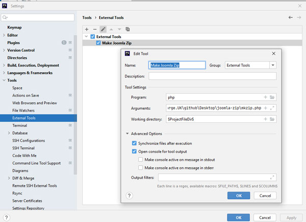

Script to create a Joomla! extension installation zip file from a PhpStorm project.

The following project folders are not included the zip file ...
* .git
* .idea
* _extras

The following project files are not included in the zip file ...
* .doc
* .md

.doc files are used to generate .pdf files which form part of the extension. 
.pdf files not normally included in github and the .doc is the master.

Configure in PHP storm _Settings / Tools / External Tools_ as shown below.

